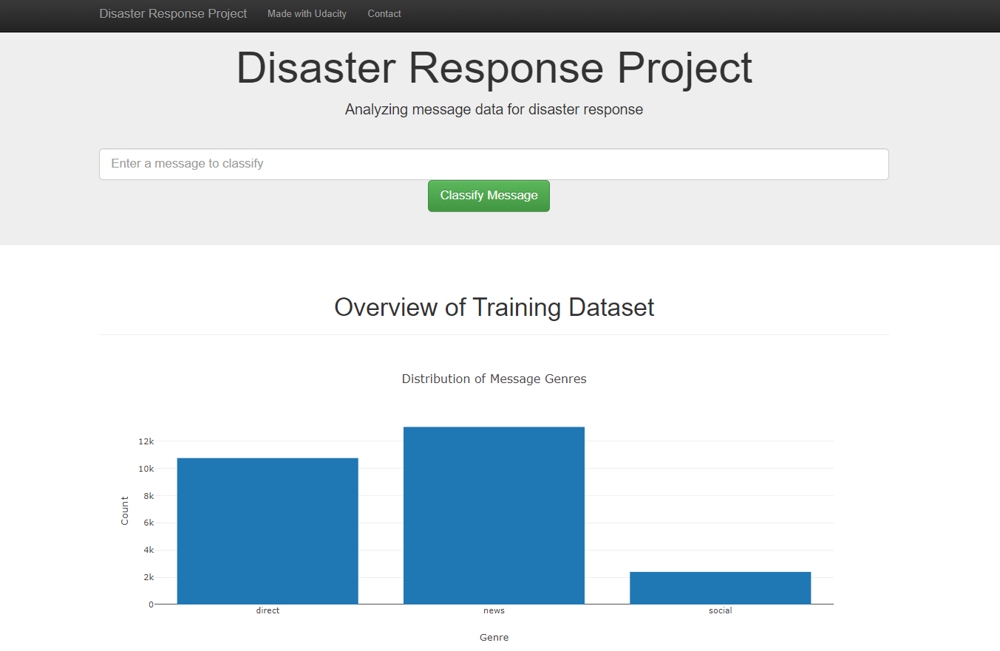
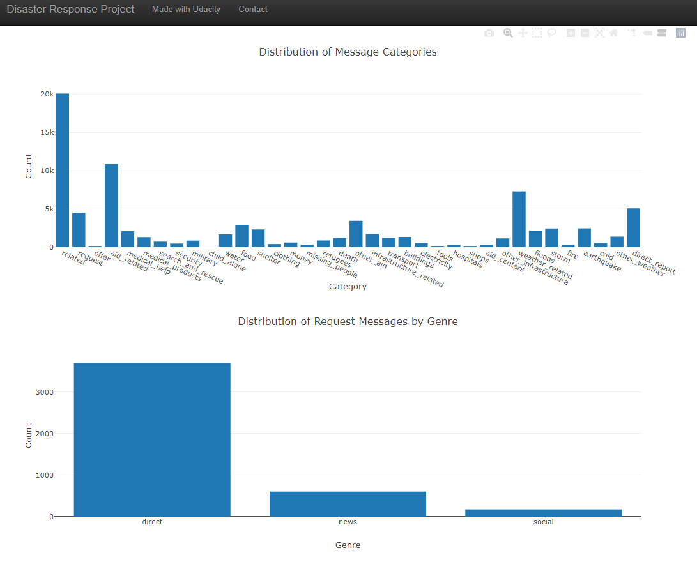
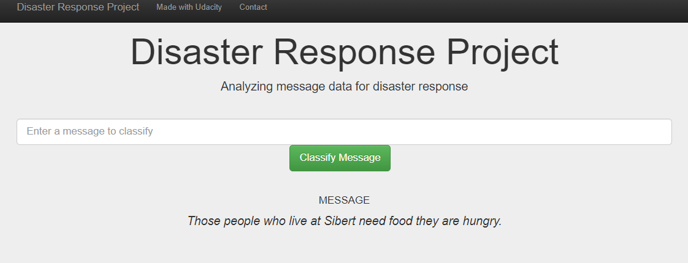
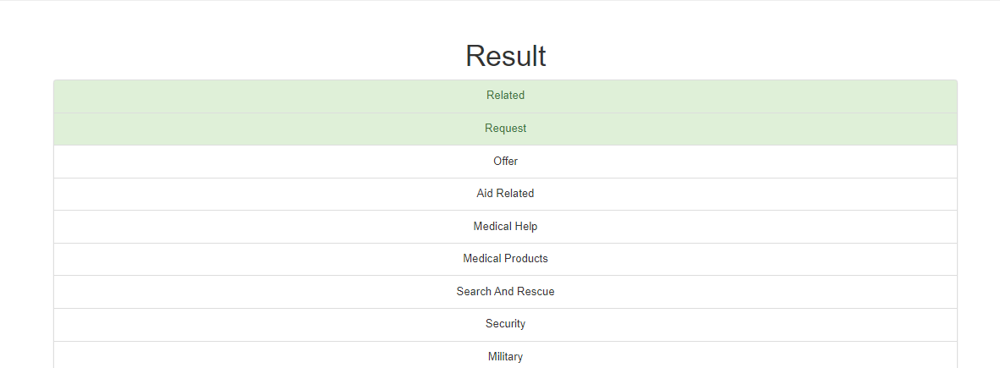

# Disaster Response Pipeline Project

## Table of Contents
1. [Description](#description)
2. [Getting Started](#getting_started)
	1. [Dependencies](#dependencies)
	2. [Installing](#installing)
	3. [Executing Program](#executing)
	4. [Additional Material](#material)
3. [Authors](#authors)
4. [License](#license)
5. [Acknowledgement](#acknowledgement)
6. [Screenshots](#screenshots)

<a name="descripton"></a>
## Description

This Project is part of Data Science Nanodegree Program by Udacity using data provided by Figure Eight.
The dataset contains pre-labelled tweet and messages from real-world disasters. 
The purpose of the project is to build a pipeline using Natural Language Processing tools that categorize the messages. The project has three components:

1. Create an ETL Pipeline to extract data from source, clean data, complete other necessary data processing steps, and save the cleaned dataframe in sqlite databse.
2. Create a Machine Learning Pipeline to train a model that will classify messages into given categories.
3. Deploy the model to a Web App that will classify messages and display charts illustrating the dataset.

<a name="getting_started"></a>
## Getting Started

<a name="dependencies"></a>
### Dependencies
* Python 3.5+ 
* NumPy
* SciPy
* Pandas
* Sciki-Learn
* NLTK
* SQLalchemy
* Flask
* Plotly

<a name="installing"></a>
### Installing
Clone this GIT repository:
```
git clone https://github.com/mknox0826/DisasterResponsePipeline.git
```
<a name="executing"></a>
### Executing Program:
1. Run the following commands in the project's root directory to set up your database and model.

    - To run ETL pipeline that cleans data and stores in database
        `python data/process_data.py data/disaster_messages.csv data/disaster_categories.csv data/DisasterCleaned.db`
    - To run ML pipeline that trains classifier and saves
        `python models/train_classifier.py data/DisasterResponse.db models/classifier.pkl`

2. Run the following command in the app's directory to run your web app.
    `python run.py`

3. Go to http://0.0.0.0:3001/

<a name="material"></a>
### Additional Material

This assignment required students to first plan out the ETL and ML pipelines in a jupyter notebook. These two notebooks can be found in the "data" and "models" folders, respectively, to get a better understanding of each step in the process. These two notebooks informed the finalized code that is run in the python scripts in[Executing Program](#executing).

<a name="authors"></a>
## Authors

* [Mica Knox](https://github.com/mknox0826)

<a name="license"></a>
## License
[](https://opensource.org/licenses/MIT)

<a name="acknowledgement"></a>
## Acknowledgements

* [Udacity](https://www.udacity.com/) for providing such a complete Data Science Nanodegree Program
* [Figure Eight](https://www.figure-eight.com/) for providing messages dataset to train my model

<a name="screenshots"></a>
## Screenshots

1. The main page displays graphs illustrating aspects of the training dataset provided by Figure 8. 


2. This is an example of a message that can be classified by the model in the app.



3. This is an example of the classification results of the message above. 
